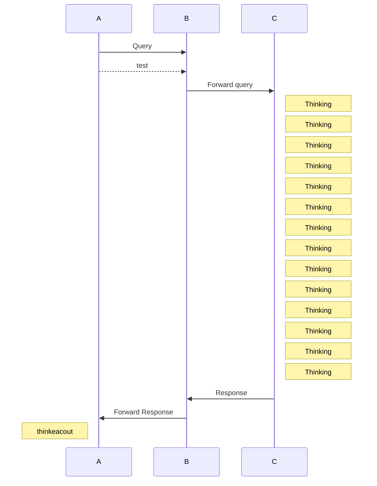
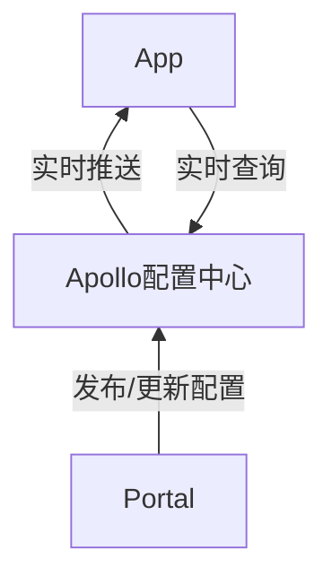
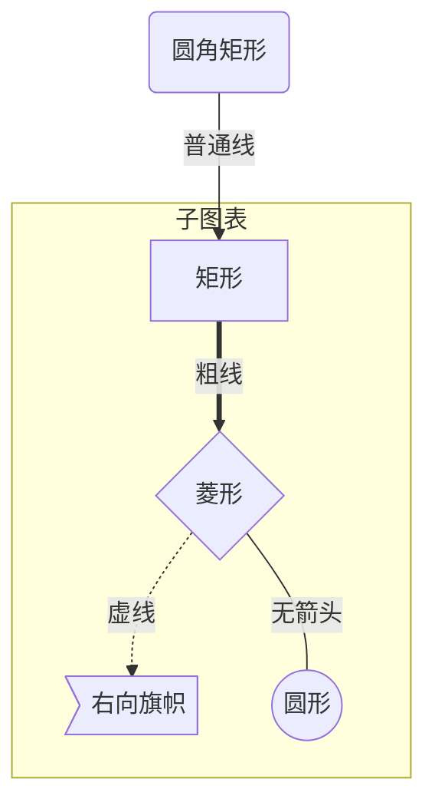

```mermaid
sequenceDiagram
A->> B: Query
A-->> B: test
B->> C: Forward query
Note right of C: Thinking
Note right of C: Thinking
Note right of C: Thinking
Note right of C: Thinking
Note right of C: Thinking
Note right of C: Thinking
Note right of C: Thinking
Note right of C: Thinking
Note right of C: Thinking
Note right of C: Thinking
Note right of C: Thinking
Note right of C: Thinking
Note right of C: Thinking
Note right of C: Thinking
C->> B: Response
B->> A: Forward Response
Note left of A: thinkeacout
```   

```mermaid
graph BT;
　　Portal-->|发布/更新配置|Apollo配置中心;
　　Apollo配置中心-->|实时推送|App;
　　App-->|实时查询|Apollo配置中心;
```

* [ ] 洗衣服
* [ ] 做饭
* [ ] 刷牙
* [x] 洗澡

```mermaid
graph TB
    id1(圆角矩形)--普通线-->id2[矩形]
    subgraph 子图表
        id2==粗线==>id3{菱形}
        id3-.虚线.->id4>右向旗帜]
        id3--无箭头---id5((圆形))
    end
```
